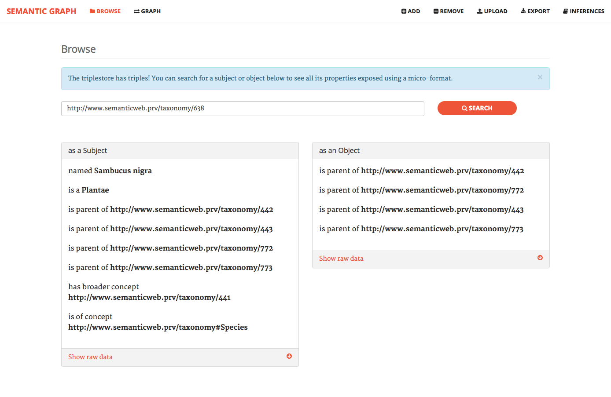
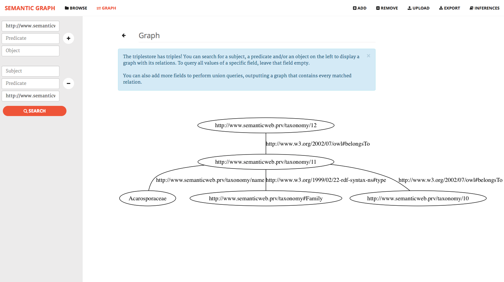

# Semantic Graph

Django application for semantic search using RDF standards.

It implements graph visualisation with GraphViz and data inference with SPARQL queries, and supports reading and writing of N-Triples, N3 and RDF/XML documents.

Additionally, data is stored in Sesame triple store following a Protégé ontology specification.


## Screenshots

### Browse section
This section allows you to query any entity (subject or object) and find every semantic relationship associated with it, published using FOAF (Friend of a Friend), SKOS (Simple Knowledge Organization System) and Microformats Species standards.



### Graph section
This section allows you to query triples and observe a relationship graph between them. You can add multiple subjects, predicates and objects, and search these simultaneously, generating a graph that merges all common entities and triples without duplicating nodes.




## How to use

[Download the latest release](https://github.com/edduarte/semantic-graph/releases) and run the following command:

```
python manage.py runserver
```

The app will be deployed to http://127.0.0.1:8000/, which you can access from a browser. You can then add triples manually or import a RDF file in the N-Triples, N3 or XML format.


